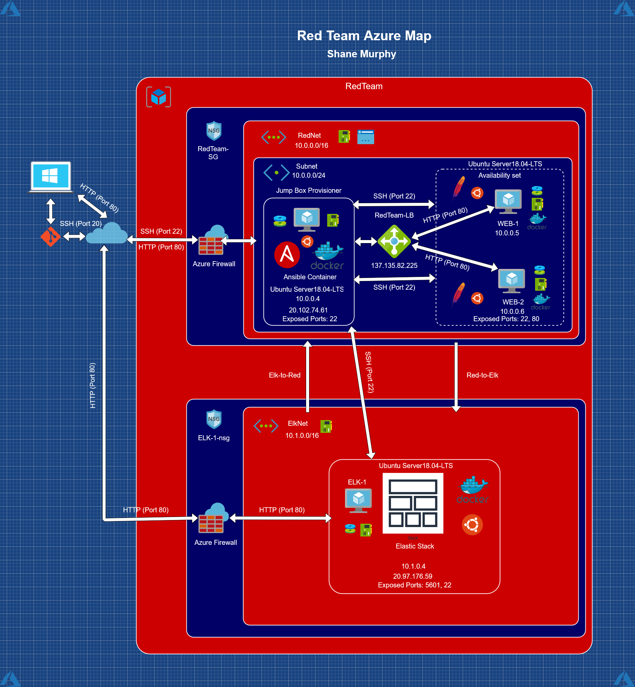

## Automated ELK Stack Deployment

The files in this repository were used to configure the network depicted below.

These files have been tested and used to generate a live ELK deployment on Azure. They can be used to either recreate the entire deployment pictured above. Alternatively, select portions of the playbook file may be used to install only certain pieces of it, such as Filebeat.

  - `Ansible/docker-python-playbook`

This document contains the following details:
- Description of the Topologu
- Access Policies
- ELK Configuration
  - Beats in Use
  - Machines Being Monitored
- How to Use the Ansible Build

### Description of the Topology

The main purpose of this network is to expose a load-balanced and monitored instance of DVWA, the D*mn Vulnerable Web Application.

Load balancing ensures that the application will be highly available, in addition to restricting access to the network.
- A load balancer intelligently distributes traffic from clients across multiple servers without the clients having to understand how many servers are in use or how they are configured. Because the load balancer sits between the clients and the servers it can enhance the user experience by providing additional security, performance, resilience and simplify scaling your website. A load balancer can add additional layers of security to your website without any changes to your application. (SOURCE: https://lumecloud.com/what-does-a-load-balancer-do/)

Security Benifits of a Load Balancers:
- Protect applications from emerging threats
- Authenticate user access
- Protect against DDoS attacks
- Simplify PCI compliance (Payment Card Industry regulations)

Integrating an ELK server allows users to easily monitor the vulnerable VMs for changes to the logs and system traffic.
- Filebeat is a lightweight shipper for forwarding and centralizing log data. Installed as an agent on your servers, Filebeat monitors the log files or locations that you specify, collects log events, and forwards them either to Elasticsearch or Logstash for indexing. (SOURCE: https://www.elastic.co/guide/en/beats/filebeat/current/filebeat-overview.html)
- Metricbeat is a lightweight shipper that you can install on your servers to periodically collect metrics from the operating system and from services running on the server. Metricbeat takes the metrics and statistics that it collects and ships them to the output that you specify, such as Elasticsearch or Logstash. Metricbeat helps you monitor your servers by collecting metrics from the system and services running on the server. (SOURCE: https://www.elastic.co/guide/en/beats/metricbeat/current/metricbeat-overview.html)

The configuration details of each machine may be found below.

| Name       | Function         | IP Address | Operating System |
|------------|------------------|------------|------------------|
| Jump Box   | Gateway          | 10.0.0.4   | Ubuntu 18.04-LTS |
| Web-1      | Web Server       | 10.0.0.5   | Ubuntu 18.04-LTS |
| Web-2      | Web Server       | 10.0.0.6   | Ubuntu 18.04-LTS |
| Elk Server | ELK Stack Server | 10.1.0.4   | Ubuntu 18.04-LTS |

### Access Policies

The machines on the internal network are not exposed to the public Internet. 

Only the Jump Box machine can accept connections from the Internet. Access to this machine is only allowed from the following IP addresses:
- User IP (https://www.whatsmyip.org/)

Machines within the network can only be accessed by SSH from the Ansible container on the Jump Box.
- 10.0.0.4

A summary of the access policies in place can be found in the table below.

| Name       | Publicly Accessible  | Allowed IP Addresses |
|------------|----------------------|----------------------|
| Jump Box   | Yes                  | User IP              |
| Web-1      | No                   | 10.0.0.4             |
| Web-2      | No                   | 10.0.0.4             |
| Elk Server | No                   | 10.0.0.4 & User IP   |

### Elk Configuration

Ansible was used to automate configuration of the ELK machine. No configuration was performed manually, which is advantageous because when working in IT, you're likely doing the same tasks over and over. 

- Ansible automates tasks that are either cumbersome, repetitive, or complex. This helps organisations drive complexity out of their environments and accelerate DevOps initiatives.

The playbook implements the following tasks:
- Installs docker.io
- Installs python3-pip
- Installs Docker Module
- Increases Virtual Memory
- Downloads & Launches a Docker ELK Container
- Enables Service Docker on Boot

The following screenshot displays the result of running `docker ps` after successfully configuring the ELK instance.

### Target Machines & Beats
This ELK server is configured to monitor the following machines:
- Web-1 10.0.0.5
- Web-2 10.0.0.6

We have installed the following Beats on these machines:
- Filebeat
- Metricbeat

These Beats allow us to collect the following information from each machine:
- Filebeat is often used to collect log files from specific processes, such as logs generated by Apache or Microsoft Azure tools.
- Metricbeat collects metrics from your systems and services such as CPU, memory usage, and services currently running on the machine.

### Using the Playbook
In order to use the playbook, you will need to have an Ansible control node already configured. Assuming you have such a control node provisioned: 

SSH into the control node and follow the steps below:
- Copy the install-elk.yml file to /etc/ansible.
- Update the /etc/ansible/hosts file to include the group with the machine IPs you want to install the elk container on.
- Run the playbook, and navigate to HTTP://(ELKserverIP):5601/app/kibana to check that the installation worked as expected.

- Which file is the playbook? Where do you copy it?
  - Filebeat playbook: filebeat-playbook.yml -> Copy to the /etc/filebeat directory. 
  - Metricbeat playbook: metricbeat-playbook.yml -> Copy to the /etc/metricbeat directory.
- Which file do you update to make Ansible run the playbook on a specific machine? How do I specify which machine to install the ELK server on versus which to install Filebeat on?
  - Update the /etc/ansible/hosts file to make Ansible run on a specific machine. Update each playbook file and edit the hosts line to specify what machines that specific playbook file runs on.
- Which URL do you navigate to in order to check that the ELK server is running?
  - HTTP://(ELKserverIP):5601/app/kibana

### User commands:
To run the playbooks for the ansible installations you need to run the following command:
- `ansible-playbook (name-of-playbook)`